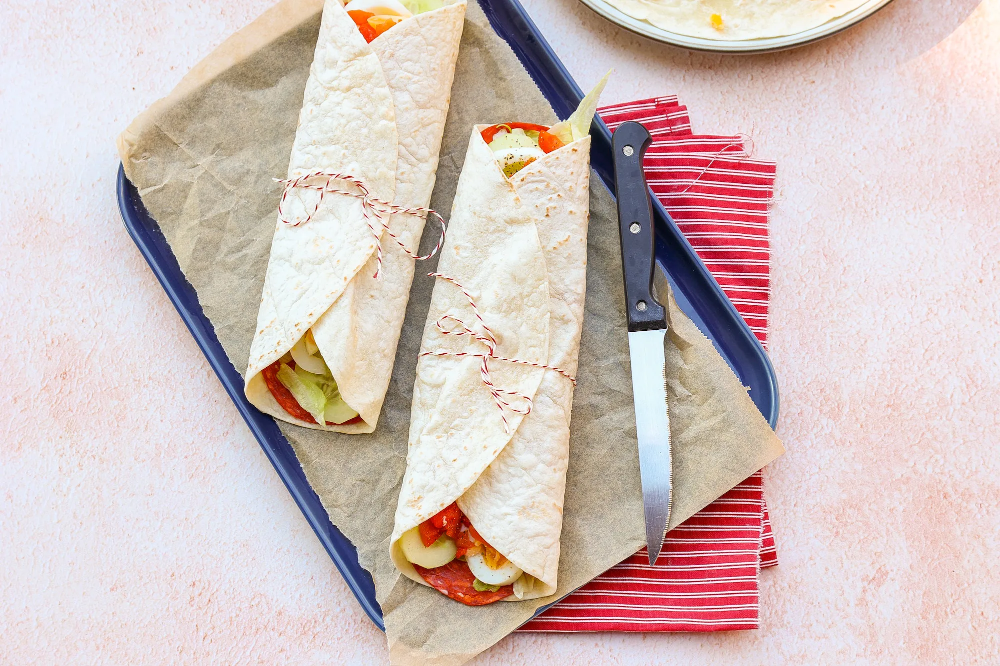

# SPAANSE WRAPS

## ingrediënten
* 4 tortilla wraps
* 12 plakjes chorizo
* 4 el aioli
* 4 eieren
* 4 geroosterde paprika's
* 50 gr ijsbergsla
* halve komkommer
* snufje peper

## Stappenplan

1. Kook de eieren in ongeveer 8 minuten hard. 

2. Snijd de eieren daarna in plakjes.

3. Snijd de komkommer in dunne plakjes en de geroosterde paprika's in stukjes.

4. Verwarm de wraps even kort op in de magnetron.

5. Besmeer de wraps met een beetje aioli.

6. Leg daarna de plakes chorizo op de wraps.

7. Verdeel dan de rest van de ingrediënten over de wraps.

8. Snufje verse peper erover en rol dan de wraps op.

9. Je kunt de wraps daarna ook in kleine stukjes snijden en als borrelhapje/tapas serveren.

